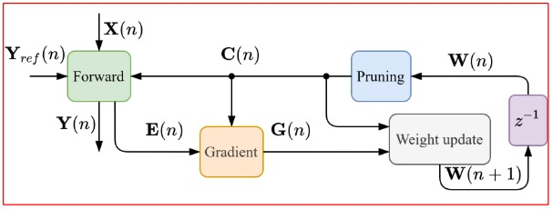
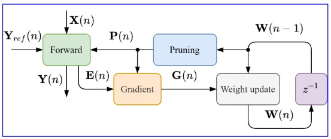
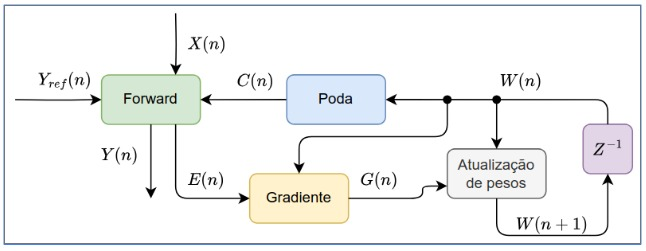
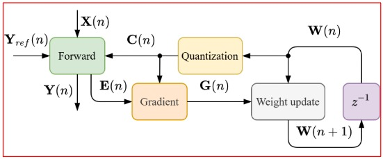
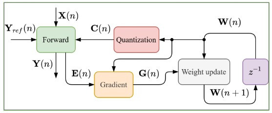
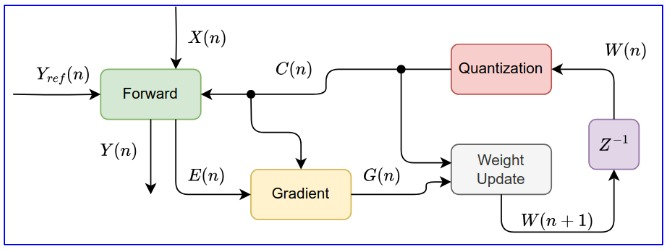
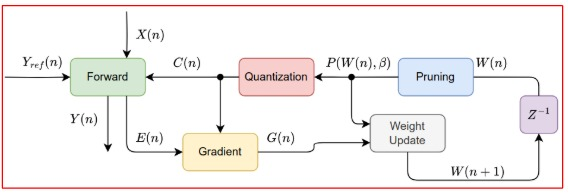
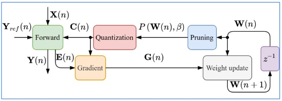
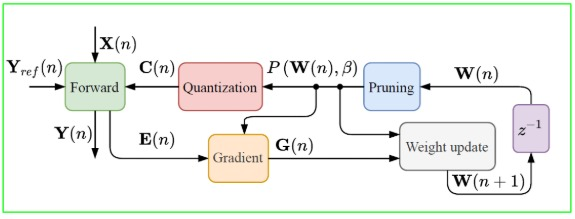
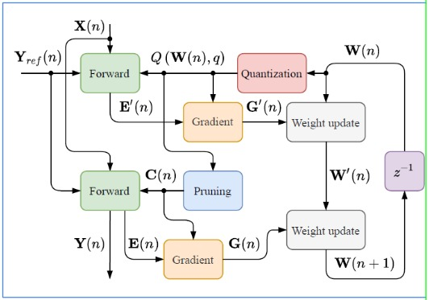

# Compression Techniques Based on Prune, Quantization, Prune Followed By Quantization and Quantization Followed by Prune

## Prune Technique
### Prune 1 ✅

### Prune 2 ✅

### Prune 3 ✅

## Quantize Technique
### Quantize 1 ✅

### Quantize 2 ✅

### Quantize 3 ✅

## Pruning Followed By Quantization Technique
### Pruning Followed By Quantization 1 ✅

### Pruning Followed By Quantization 2 ✅

### Pruning Followed By Quantization 3 ✅

## Quantization Followed By Prune Technique
### Quantization Followed By Prune 1 ❌

## Quantization Followed By Prune Technique
### Quantization Followed By Prune 2 ❌

